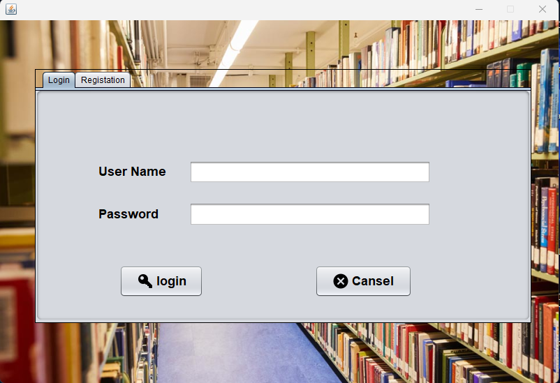
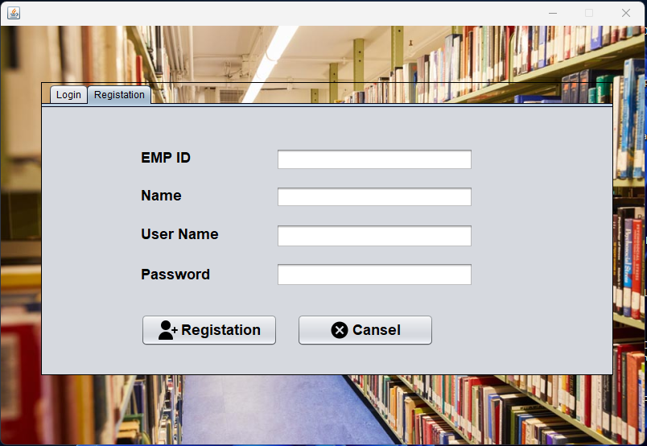
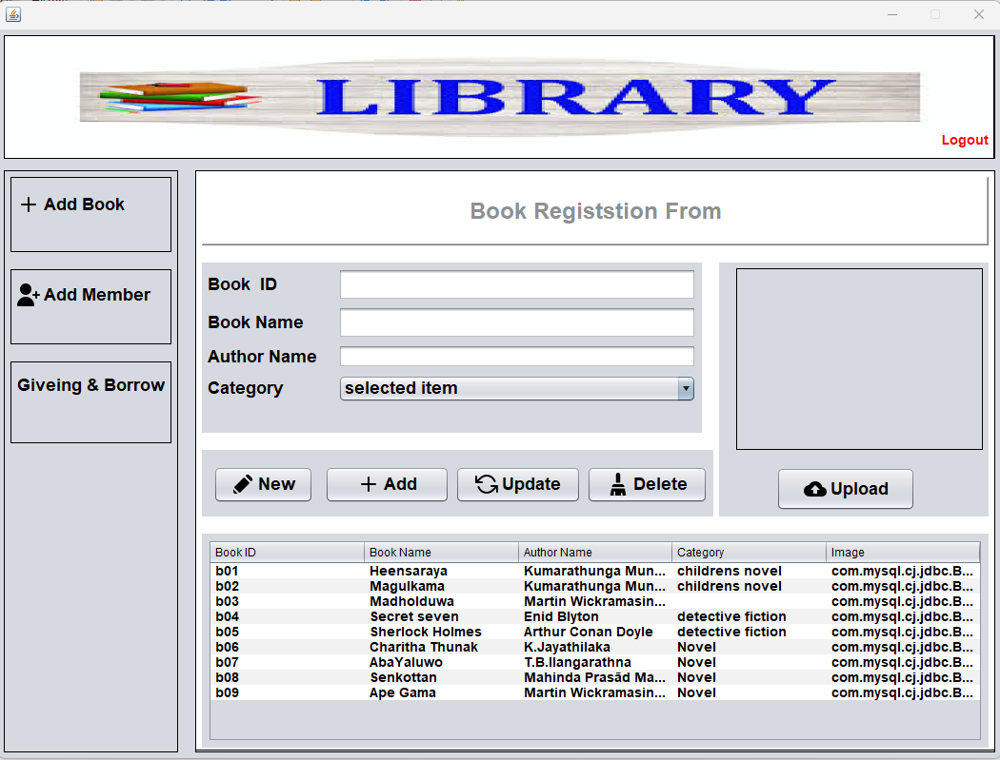
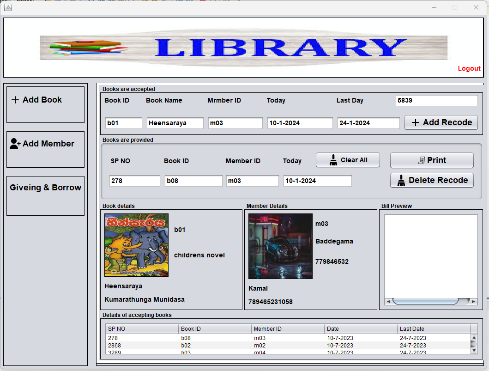

# Library Management System

📌 **Overview**  
The Library Management System is a Java-based application developed using **NetBeans IDE** and **MySQL**. It provides a user-friendly interface for managing books, users, and transactions. Key functionalities include user authentication, book issuance, returns, billing, and more. This project is designed to streamline library operations efficiently.

---

## 🚀 **Features**  
- **User Authentication**: Secure registration and login with data validation.
- **Image Upload**: Store and retrieve user profile images in the database.
- **Book Management**: Add, update, delete, and search for books.
- **User Management**: Register and manage user details.
- **Transaction Handling**: Issue and return books with automated billing.
- **Print Bill Feature**: Generate and print bills for transactions.

---

## 🛠️ **Technologies Used**  
- **Java (NetBeans IDE)**: For GUI development and backend logic.
- **MySQL**: For database management.
- **JDBC**: For database connectivity.

---

## 🔧 **Functionality**  
1. **Register & Login Forms**: Validate user input and store credentials securely.
2. **CRUD Operations**: Perform Insert, Update, Delete, and Search operations on books and users.
3. **Image Upload**: Store and retrieve images from the database.
4. **Print Bill Feature**: Generate and print transaction bills.

---

## 📷 **Screenshots**  
Here are some screenshots of the application in action:  

| **Login Screen** | **Registration Screen** | **Book Management Screen** |  
|------------------|-------------------------|----------------------------|  
|  |  |  |  

| **Transaction Screen** |
|------------------------|
|  |

---

## 🛠️ **Setup Instructions**  
1. **Prerequisites**:  
   - Install Java Development Kit (JDK).  
   - Install NetBeans IDE.  
   - Install MySQL and set up a database.  

2. **Clone the Repository**:  
   ```bash
   git clone https://github.com/yourusername/library-management-system.git
